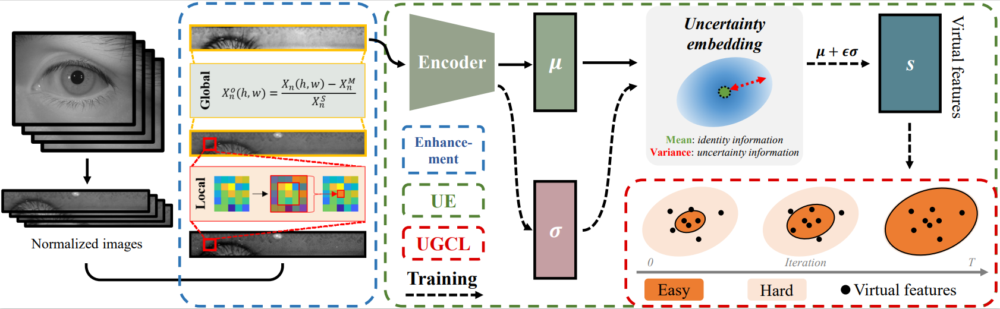
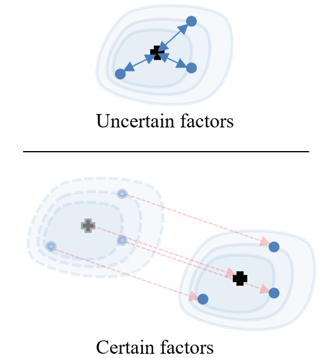
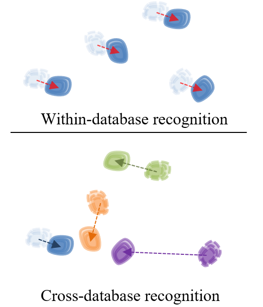

# Uncertainty Embedding

This is the implementation of "Towards More Discriminative and Robust Iris Recognition by Learning Uncertain Factors" (accepted by T-IFS). 
In the acquisition process, each iris image is a single sampling result of an iris texture under a certain acquisition condition. 
Therefore, iris images are inevitably affected by various acquisition factors. 
These acquisition factors are not only tightly entangled with identity features but also entangled with each other.
This work proposes a probabilistic representation method named uncertainty embedding to learn more discriminative and robust identity features.
In addition, this representation method can be extended to the unsupervised recognition scenario.




## Table of Contents
- [Analysis](#Analysis)
- [Prerequisites](#Prerequisites)
- [Dataset](#Dataset)
- [Usage](#Usage)
- [Contribution](#Contribution)
- [Results](#Results)


## Analysis
Among these acquisition factors, some of them are driven by the acquisition condition and can be regarded as certain factors.
The others are out of human control, a.k.a., uncertain factors, leading to acquisition uncertainty.
Regardless of certain or uncertain factors, both shift iris features away from the identity feature (i.e., class center).
However, the former is tolerable for within-database recognition since these acquisition factors equivalently affect iris images of the same dataset and do not enlarge the intra-class distance.
The latter is non-negligible because uncertain factors randomly shift iris features around the class center and increase the intra-class distance.
Therefore, a new representation is urgently needed to learn an identity feature on the class center rather than an iris feature which may be located at the class cluster boundary for iris recognition.




In addition, certain factors may convert to uncertain ones in some scenarios, such as the cross-database setting.
These converted factors reduce the inter-class distance rather than increase the intra-class distance, which also makes features ambiguous.
However, these uncertain factors cannot be learned due to the lack of testing images. 
A data-independent approach could mitigate this uncertainty from the cross-database setting.




## Prerequisites
This implementation is based on platform of pytorch 1.7, our environment is:
- Linux
- Python 3.6
- CPU or NVIDIA GPU + CUDA CuDNN
- Pytorch 1.7
- Torchvision  0.8.2
- Pillow  8.1
- Numpy   1.19.5
- Scikit-learn  0.24.0
- Scipy  1.5.4
- Ipython  7.16.1
- Thop (for computational complexity)


## Dataset
Before running the train/test code, it is necessary to 1) download the dataset and 2) configure the data-config file.
### Data download
The CASIA-website ([SIR](http://www.cripacsir.cn/dataset/)) provides 
- the localization results to generate normalized iris images,
- training/testing protocols.

Meanwhile, you can also download normalized iris images of CASIA datasets, including CASIA-iris-V4, CASIA-iris-Mobile, and CASIA Cross Sensor Iris Recognition dataset.


Original iris database:
- CASIA-iris-V4/mobile/cross sensor iris recognition dataset: http://www.cripacsir.cn/dataset/
- ND-CrossSensor-Iris-2013 dataset: https://cvrl.nd.edu/projects/data/#nd-crosssensor-iris-2013-data-set

### Configure the data-config file
Image data and protocol files can be placed anywhere in the system, but the corresponding configuration file (in the file folder of _data_config_) must be rewritten.

For example, we should modify the file of _./data_config/Distance_Within_config.py_ if we want to obtain the recognition results on the Distance dataset under the within-database setting.

```python
class Config(object):
    def __init__(self):
        # image path
        self._root_path = []
        self._train_list = []
        self._num_class = []  
        ##### training dataset #######
        self._root_path.append('../../CASIA-Iris-Distance/')   # [TODO] The path of the training image file
        self._train_list.append('../../CASIA-Iris-Distance/train.txt')   # [TODO] The position of training protocol 
        self._num_class.append(142)  # [TODO] The number of the classes

        ##### testing dataset #######
        self._root_path_test = ['../../CASIA-Iris-Distance/']   # [TODO] The path of the training image file
        self._test_list = ['../../CASIA-Iris-Distance/test.txt']   # [TODO] The position of testing protocol 
        
        ##### logging setting #######
        self.data_name = 'CASIA IrisV4-distance'  # Dataset name (for logging)
        self.test_type = 'Within'                 # cross/within (for logging)
        
        ...
```


## Usage
Different training file corresponds to different recognition tasks:
- train_iris.py --> the same-sensor recognition
- train_CS_iris.py --> the cross-sensor recognition
- train_CSpetra_iris.py --> the cross-spectral recognition

Here, we take _train_iris.py_ and _test_DETGen.py_ as example.
### Step-1: Select data-config file
You can freely select dataset and within/cross-database settings after configuring all data-config files.
In _train_iris.py_, we select training on the Distance dataset under within-database setting by uncommenting _config = DisIn_config()_
```python
...

# line 345
if __name__ == "__main__":
    
    ## data config
    # config = MobIn_config()
    # config = LmpIn_config()
    config = ThsIn_config()
    # config = DisIn_config()

    ## model config    
    input_args = arcface_UE()
        
    trainer = UETrainer(input_args, config)
    trainer.train_runner()

```
This implementation use the following abbreviations:
- Mob = the Mobile dataset
- Lmp = the Lamp dataset
- Ths = the Thousand dataset
- Dis = the Distance dataset
- NDCS = the ND-CrossSensor-Iris-2013 dataset
- CSIR = the CASIA cross sensor iris recognition dataset
- Crs = the cross-database setting
- In  = the within-database setting

### step-2: run the training code
```linux
CUDA_VISIBLE_DEVICES=0 python train_iris.py
```
This cmd will generate logging file in the file folder of _log_save_ and trained model in the file folder of _checkpoint_.


### step-3: run the testing code
Before running the testing code, we must modify _test_DETGen.py_ as follows:
```python
...

# line 195
if __name__ == "__main__":
     
    input_args = arcface_dul()
    # ---- Distance within -------
    config = DisIn_config()   # select the Distance dataset and within-database setting
    checkpoint_path='./checkpoint/CASIADistance_Within_UE/epoch_100-eer_0.0109.pth'   # Position of the trained model
    mat_path='./features/Distance_Within_UE.mat'   # Path of mat-file. 
```
Then, you can use the testing cmd to generate experimental results and data for DET-curves.
```linux
CUDA_VISIBLE_DEVICES=0 python test_DETGen.py
```
This cmd will generate a mat-file named _Distance_Within_UE_, it contains detailed experimental results, including features, gorund-true labels, similarity matrix, fpr values, and tpr values.


## Contribution
This section points out the corresponding codes of main contributions of the paper in brief, and you can make an extension based on these codes.

### Uncertainty embedding
_./model/UE_maxoutBN_model.py_ contains the uncertainty embedding representation. 
```python
# line 48
class UE(nn.Module):
    ...
        self.mu_head = nn.Sequential(
            nn.BatchNorm2d(192, eps=2e-5, affine=False),
            nn.Dropout(p=drop_ratio),
            Flatten(),
            mfm(5*5*192, feature_dim, type=0),
            nn.BatchNorm1d(feature_dim, eps=2e-5))

        # use logvar instead of var !!!
        if used_as == 'UE':
            self.logvar_head = nn.Sequential(
                nn.BatchNorm2d(192, eps=2e-5, affine=False),
                nn.Dropout(p=drop_ratio),
                Flatten(),
                mfm(5*5*192, feature_dim, type=0),
                nn.BatchNorm1d(feature_dim, eps=2e-5))

    def _reparameterize(self, mu, logvar):
        std = torch.exp(logvar).sqrt()
        epsilon = torch.randn_like(std)
        sampler = epsilon * std
        return (mu + sampler, sampler)

    def forward(self, x):   
        x = self.features(x)
        if self.used_as == 'backbone':
            ...
        else:
            mu = self.mu_head(x)
            logvar = self.logvar_head(x)
            logvar = logvar.abs()
            embedding, sampler = self._reparameterize(mu, logvar)

            score = 1/((1/(sampler.abs()+1e-4)).mean(dim=1,keepdim=False)+1e-4)
            

        return (mu, logvar, embedding, score)
```
### Uncertainty-guided curriculum learning
_./model/UE_maxoutBN_model.py_ computes the difficulty scores of different samples. 
```python
# line 48
class UE(nn.Module):    
    ...
    def _reparameterize(self, mu, logvar):
        std = torch.exp(logvar).sqrt()
        epsilon = torch.randn_like(std)
        sampler = epsilon * std
        return (mu + sampler, sampler)
    def forward(self, x):
    ... 
            score = 1/((1/(sampler.abs()+1e-4)).mean(dim=1,keepdim=False)+1e-4)
    ...
```
Besides, _train_iris.py_ performs the curriculum learning according to the estimated difficulty scores.

```python
# line 191
    def _UGCL_instance_sampler(self, score, epoch, batch_size):
        def _value_stretch(value):
            return (value-value.min())/(value.max()-value.min())
        if epoch <= 0:
            return None
        else:
            # stretch_score = _value_stretch(score)
            weight = torch.zeros_like(score)
            threshold = 1./(1.+math.exp(-epoch*0.5))
            _, sort_idx = score.sort()
            learning_num = min(round(batch_size*threshold),batch_size)
            weight[sort_idx[:learning_num]]=1
            
            return weight
    def _train_one_epoch(self, epoch = 0):
        ...
            instance_samples = self._UGCL_instance_sampler(score, epoch, img.size(0))
            output  = self.model['fc_layer'](embedding, gty)
            loss    = self.model['criterion'](output, gty, \
                                              weight = instance_samples, \
                                              mu = mu, \
                                              logvar = logvar)
        ...
```

### Enhancement module
_load_norm_imglist.py_ provides this enhancement module.
```python
# line 7 
def default_loader(path):
    img = Image.open(path).convert('L')
    img = img.filter(ImageFilter.MedianFilter(size=3))  # the normalized iris images from CASIA website have been filtered using median filter
    return img
...
# line 41
class ImageList(data.Dataset):
    def __init__(self, root, fileList, transform=None, list_reader=multi_list_reader, loader=default_loader):
        ...
        self.imgList   = list_reader(root,fileList)
        ...
    def __getitem__(self, index):
        img_root, imgPath, target = self.imgList[index]
        # load image and filter it using median filter (local step)
        img = self.loader(os.path.join(img_root, imgPath))
    
        if self.transform is not None:
            img = self.transform(img)
        
        # global step
        img_mean = img.mean()
        img_std = img.std()+1e-8
        img = (img-img_mean)/img_std
        
        return img, target
```

## Results

Recognition performance under the ***within-database*** setting:
| Dataset | EER (%) | $10^{-1}$ (%) |$10^{-3}$ (%) |$10^{-5}$ (%) |
| :-----:| :----: | :----: | :----: | :----: |
| Lamp | 0.44 | 0.02 |0.97 | 3.60 |
| Thousand | 0.63 | 0.06 | 1.74 | 8.95 |
| Distance | 1.09 | 0.12 | 3.70 | 13.62 |
| Mobile | 0.42 | 0.04 | 0.65 | 2.67 |
| NDCS | 1.59 | 0.74 | 4.80 | 15.20 |
| CSIR | 4.52 | 2.72 | 17.31 | 41.58 |


Recognition performance under the ***cross-database*** setting:
| Dataset | EER (%) | $10^{-1}$ (%) |$10^{-3}$ (%) |$10^{-5}$ (%) |
| :-----:| :----: | :----: | :----: | :----: |
| Lamp | 0.45 | 0.03 |0.95 | 3.68 |
| Thousand | 0.98 | 0.08 | 3.57 | 19.18 |
| Distance | 1.17 | 0.13 | 4.16 | 13.54 |
| Mobile | 0.53 | 0.05 | 1.48 | 4.53 |
| NDCS | 2.98 | 1.58 | 11.03 | 33.45 |
| CSIR | 5.92 | 4.40 | 23.19 | 48.72 |

